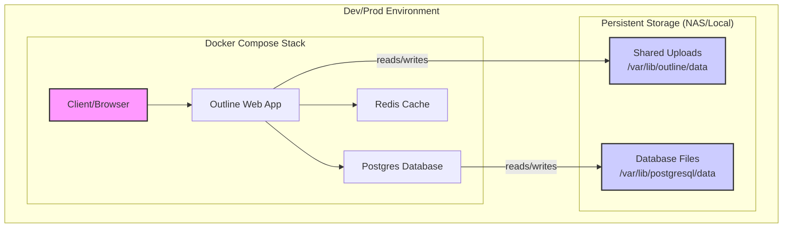

# Architecture Overview (Scene 1)

This document provides a high-level overview of the Outline stack's architecture as of the Scene 1 release. The core design principle is **development and production parity**, ensuring that the local environment mirrors the NAS deployment.

## System Diagram

The diagram below illustrates the primary components and their interactions.

**Key Principles:**

- **Dev⇄Prod Parity**: The same `docker-compose-outline.yml` file runs in both environments. The only difference is the environment file used (`.env` for local dev, `.env.prod` for the NAS).
- **NAS Roots**: The canonical path for the project on the production NAS is `/volume1/Docker/outline`. Locally, it resides at `~/infra-projects/outline`.

## Shared Paths & Mounts

Persistent data is handled via Docker volumes mapped to the host filesystem. This ensures data integrity across container restarts and updates.

| Service    | Host Path (Relative) | Container Path             | Purpose                    |
| :--------- | :------------------- | :------------------------- | :------------------------- |
| `outline`  | `./storage`          | `/var/lib/outline/data`    | **Shared uploads mount**   |
| `postgres` | `./db`               | `/var/lib/postgresql/data` | Database files             |
| `redis`    | `./redis`            | `/data`                    | Redis data store (caching) |

## Security/Stability Posture at Scene 1

The system's posture is designed for private, trusted use.

- **What's Covered**:
  - **Network Isolation**: The stack is not exposed to the public internet. Access is exclusively handled via a private Tailscale network, using MagicDNS for service resolution.
  - **Stable Services**: The Docker Compose stack is considered stable for production use within this private context.
  - **Configuration as Code**: The entire stack is defined declaratively, promoting consistency and easy verification.
  - **CI Gates**: Code quality and commit standards are enforced automatically.

- **Intentionally Out of Scope (for Scene 1)**:
  - **Public Access**: No public-facing reverse proxy or TLS termination is configured.
  - **Automated Backups**: A formal, automated backup solution for the database and shared uploads is deferred to Scene 2. Manual backups are recommended in the interim.
  - **Intrusion Detection/Hardening**: Advanced security measures are not yet implemented. The security model relies on the private network boundary.
